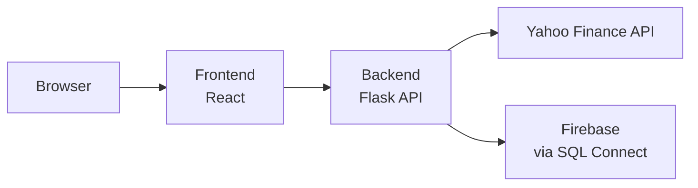
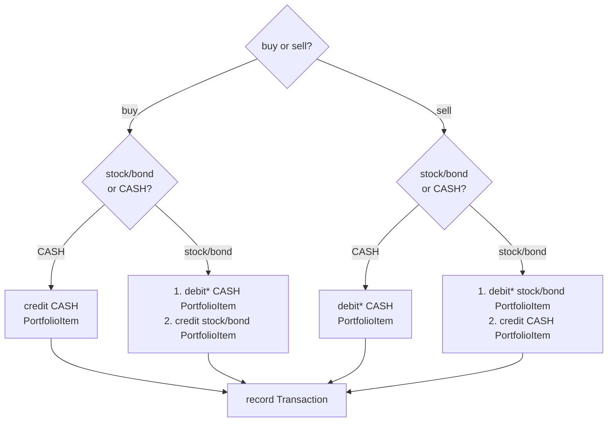
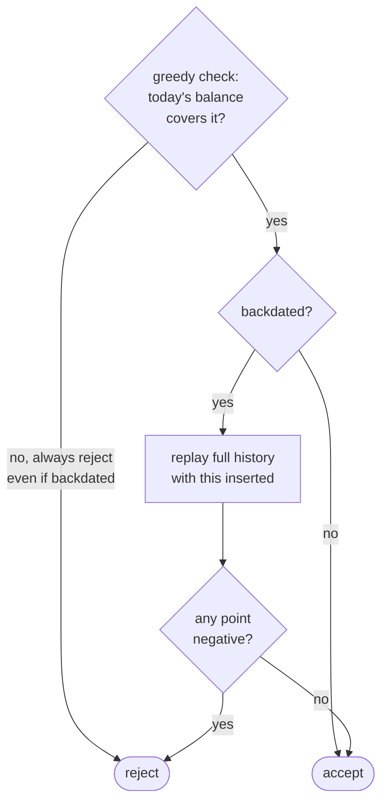

# Architecture

## Frontend Routes

- `/`
- `/holdings`
- `/transactions`

## Backend Routes

- `/api/portfolio`
- `/api/transactions`
- `/api/prices`
- `/api/performance`

## POST /api/transactions Flow

\* debit steps all go through the same check:

## Work Split

| Person | Area |
|---|---|
| Shuqing | Frontend |
| Yangxian | Backend — Performance API & DB |
| Emmelyn | Backend — all other APIs (portfolio & transactions) |
