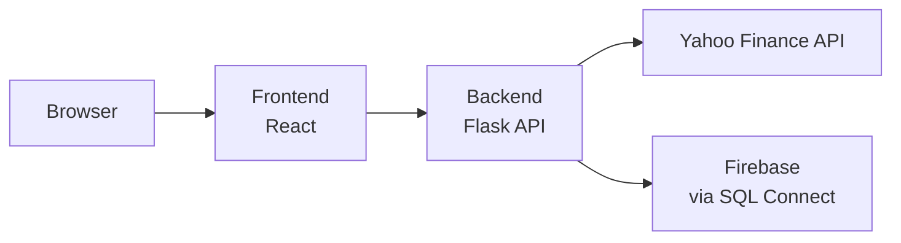

# Architecture

```mermaid
flowchart LR
    Browser["Browser"] --> Frontend["Frontend\nReact"]
    Frontend --> Backend["Backend\nFlask API"]
    Backend --> Yahoo["Yahoo Finance API"]
    Backend --> Firebase["Firebase\nvia SQL Connect"]
```

## Frontend Routes

- `/`
- `/holdings`
- `/transactions`

## Backend Routes

- `/api/portfolio`
- `/api/transactions`
- `/api/prices`
- `/api/performance`
