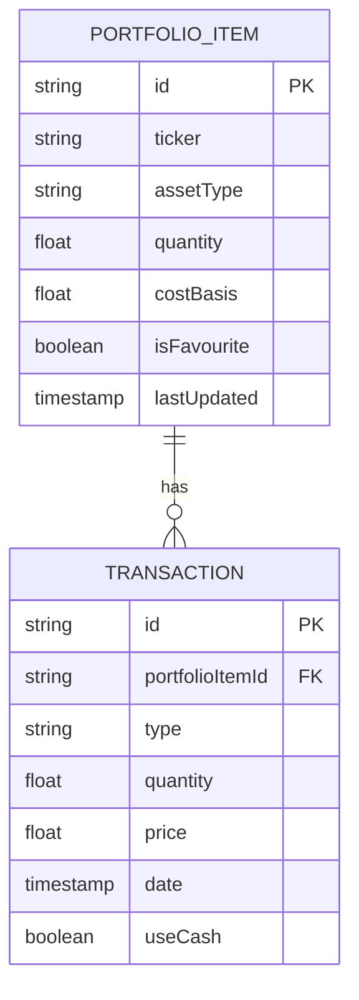

# ER Diagram

`PortfolioItem` has its own `id`.

`Transaction` has its own `id` and stores a foreign key to `PortfolioItem.id`.

The unique constraint for `PortfolioItem` is composite: `(ticker, assetType)` must be unique together.

