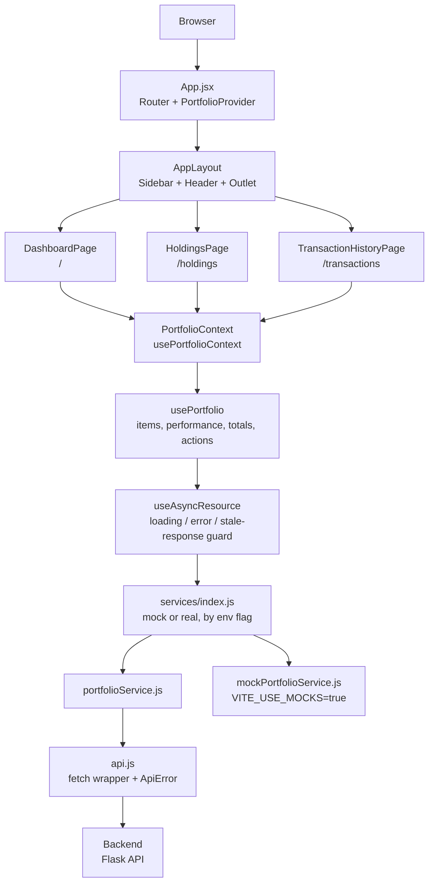

# Portfolio Manager - Frontend

A modern, responsive React-based frontend for the Portfolio Manager application. Built with Vite, React Router and Tailwind CSS to provide a fast, scalable user interface for managing investment portfolios.

## Overview

The frontend is a single-page app with three routes, one shared portfolio state container, and a
services layer that can be pointed at either the Flask backend or an in-memory mock. Every page
reads the same portfolio state through React Context, so a trade made from the header refreshes
the dashboard, the holdings table and the transaction history together.



Layer responsibilities:

| Layer | Location | Responsibility |
| --- | --- | --- |
| Pages | `src/pages/` | One per route; own page-local UI state (filters, sorting, modals) |
| Components | `src/components/` | Presentational building blocks, grouped by feature |
| State | `src/context/`, `src/hooks/` | A single portfolio store shared by every page |
| Services | `src/services/` | Data fetching, backend/mock selection, response shaping |
| Domain helpers | `src/constants/`, `src/utils/` | Shared constants, formatting and portfolio/transaction logic |

See [../docs/Architecture.md](../docs/Architecture.md) for how the frontend fits into the wider system.

## Tech Stack

- **React 19** - UI library for building component-based interfaces
- **Vite 8** - Build tool and dev server
- **React Router DOM 7** - Client-side routing and navigation
- **Tailwind CSS 4** - Utility-first CSS framework, wired up through `@tailwindcss/postcss`
- **Recharts 3** - Composable React chart library for data visualization
- **TypeScript 6** - Used as a type checker over the JS/JSX sources (`allowJs`, `noEmit`); there are no `.ts` source files
- **PostCSS & Autoprefixer** - CSS processing and browser compatibility

## Setup

### Prerequisites

- Node.js 18+ and npm
- Git

### Installation

1. Navigate to the frontend directory:
   ```bash
   cd frontend
   ```

2. Install dependencies:
   ```bash
   npm install
   ```

3. Create a `.env` from the example and adjust as needed:
   ```bash
   cp .env.example .env
   ```

### Environment Variables

| Variable | Default | Purpose |
| --- | --- | --- |
| `VITE_API_URL` | `http://localhost:5000` | Base URL of the Flask backend |
| `VITE_USE_MOCKS` | – | Set to `true` to run the UI against in-memory fixtures with no backend |

## Running the Application

### Development Server

Start the Vite development server with hot module replacement (HMR):

```bash
npm run dev
```

The app is served at `http://localhost:3001` (configured in `vite.config.js`, which also opens a
browser automatically) and reloads when you make changes.

### Type Checking

```bash
npm run typecheck
```

### Production Build

Create an optimized production build. This runs `tsc` first, so type errors fail the build:

```bash
npm run build
```

The built files will be in the `dist/` directory.

### Preview Production Build

```bash
npm run preview
```

## Project Structure

```
frontend/
├── index.html               # Vite entry HTML
├── vite.config.js           # Dev server (port 3001) and React plugin
├── tailwind.config.js       # Theme extensions aligned with the CSS tokens
├── tsconfig.json            # Type-checking config for the JS/JSX sources
└── src/
    ├── components/
    │   ├── common/              # Reusable UI primitives
    │   │   ├── Button.jsx
    │   │   ├── Card.jsx
    │   │   ├── EmptyState.jsx
    │   │   ├── ErrorState.jsx   # Full-page error + ErrorBanner
    │   │   ├── FormControls.jsx
    │   │   ├── LoadingSpinner.jsx
    │   │   ├── Modal.jsx
    │   │   ├── SegmentedControl.jsx
    │   │   ├── StatTile.jsx
    │   │   └── Table.jsx
    │   ├── dashboard/           # Dashboard-specific components
    │   │   ├── AllocationPieChart.jsx
    │   │   ├── HoldingsPreview.jsx
    │   │   ├── PerformanceChart.jsx
    │   │   └── TimeRangeFilter.jsx
    │   ├── holdings/            # Holdings page components
    │   │   ├── FavouriteStar.jsx
    │   │   ├── HoldingsSummaryCards.jsx
    │   │   └── HoldingsTable.jsx
    │   ├── portfolio/           # Buy/sell flow, reachable from the header
    │   │   ├── TransactionButton.jsx
    │   │   └── TransactionModal.jsx
    │   ├── transactions/        # Transaction history components
    │   │   ├── TransactionSummaryCards.jsx
    │   │   └── TransactionsTable.jsx
    │   └── layout/              # Layout and navigation
    │       ├── AppLayout.jsx    # Sidebar + header + routed outlet
    │       ├── Header.jsx       # Portfolio totals and buy/sell actions
    │       └── Sidebar.jsx      # Primary navigation
    ├── pages/                   # Route components
    │   ├── DashboardPage.jsx
    │   ├── HoldingsPage.jsx
    │   └── TransactionHistoryPage.jsx
    ├── services/                # API and data services
    │   ├── api.js               # fetch wrapper, ApiError, get/post/patch
    │   ├── index.js             # Selects the mock or real service
    │   ├── portfolioService.js  # Backend-backed service + response enrichment
    │   ├── mockPortfolioService.js
    │   └── mockData.js
    ├── context/
    │   └── PortfolioContext.jsx # Provider + usePortfolioContext
    ├── hooks/
    │   ├── usePortfolio.js      # Owns portfolio state; instantiated once by the provider
    │   └── useAsyncResource.js  # Loading/error state with stale-response protection
    ├── constants/               # Shared domain constants
    │   ├── portfolio.js         # Asset types, time ranges, chart palette, limits
    │   └── transactions.js      # Transaction actions and filter options
    ├── utils/                   # Formatting and domain helpers
    │   ├── format.js
    │   ├── portfolio.js
    │   └── transactions.js
    ├── App.jsx                  # Root component: provider + routes
    ├── main.jsx                 # React DOM entry point
    └── index.css                # Theme tokens and global styles
```

## Architecture Details

### Routing

The application uses React Router with a nested layout pattern:

- **`/`** - Dashboard (summary stats, allocation chart, performance chart, holdings preview)
- **`/holdings`** - Holdings table with type filtering and sorting
- **`/transactions`** - Transaction history with search, action filter and sorting

Any unmatched path redirects to `/`. All routes render inside `AppLayout`, which supplies the
sidebar, the header and the content outlet.

### State Management

- **`PortfolioProvider`** wraps the router in `App.jsx` and calls `usePortfolio` exactly once.
- **`usePortfolio`** owns holdings, performance history, the selected time range, derived totals
  (total value, cost basis, cash balance, total return) and the buy/sell/favourite actions.
  Components should not call it directly.
- **`usePortfolioContext`** is the consumer hook; it throws if used outside the provider.
- **`useAsyncResource`** backs each fetch with loading/error state and ignores responses from
  superseded requests, so a slow reply cannot overwrite a newer one.
- **`dataVersion`** is bumped after every successful trade. Views that own data the context does
  not manage — transaction history — refetch when it changes.

Favouriting is applied optimistically and rolled back if the request fails.

### Component Hierarchy

```
App (PortfolioProvider + Router)
└── AppLayout (Sidebar + Header + Outlet)
    ├── DashboardPage
    │   ├── AllocationPieChart
    │   ├── PerformanceChart + TimeRangeFilter
    │   ├── HoldingsPreview
    │   └── TransactionModal
    ├── HoldingsPage
    │   ├── HoldingsSummaryCards
    │   └── HoldingsTable → FavouriteStar
    └── TransactionHistoryPage
        ├── TransactionSummaryCards
        └── TransactionsTable
```

### Styling Approach

- **CSS Custom Properties** - Colour, shadow and gridline tokens declared once in `index.css`
  using `light-dark()`, so the light and dark palettes sit side by side.
- **Theme switching** - `color-scheme: light dark` follows the OS by default; setting
  `data-theme="light"` or `data-theme="dark"` on `<html>` pins it.
- **Tailwind CSS 4** - Utilities plus a small `tailwind.config.js` that keeps `shadow-*` in sync
  with the `--shadow-*` tokens.
- **Icons** - Inline SVG paths, kept next to the data they belong to (see `Sidebar.jsx`).

## Data Services

### Service Selection

`services/index.js` re-exports one implementation of the data API:

```
getPortfolioItems  getPerformance  buyAsset  sellAsset  getTransactions  toggleFavourite
```

With `VITE_USE_MOCKS=true` these resolve to `mockPortfolioService.js`, which serves mutable
in-memory fixtures with simulated latency and needs no backend. Otherwise they resolve to
`portfolioService.js`, which talks to the Flask API through `api.js`.

### Response Enrichment

`portfolioService.js` normalises backend rows for the UI:

- Derives `gainLoss` / `gainLossPercent` from `costBasis` and `unrealizedPnL`.
- Prices `CASH` at par, since the backend has no price concept for it.
- Values an unpriceable ticker at cost with unknown gain/loss, rather than at `$0`; those rows
  render as `N/A`.

### Error Handling

`api.js` throws an `ApiError` carrying the HTTP status and response body. It tolerates non-JSON
error responses (an HTML 5xx page from a proxy surfaces as a status, not a parse error).

## Development Tips

### Adding a New Component

1. Create it in the matching `components/` subdirectory (`common/` only if it is feature-agnostic).
2. Reuse the primitives in `common/` — `Card`, `Table`, `StatTile`, `SegmentedControl`.
3. Style with Tailwind utilities and the `var(--…)` theme tokens rather than hard-coded colours.

### Adding a New Page

1. Create a file in `pages/`.
2. Register the route in `App.jsx` inside the `AppLayout` route:
   ```jsx
   <Route path="/new-page" element={<NewPage />} />
   ```
3. Add an entry to `NAV_ITEMS` in `Sidebar.jsx`.

### Accessing Portfolio Data

```jsx
import { usePortfolioContext } from '../context/PortfolioContext'

function MyComponent() {
  const { items, totalValue, itemsLoading, error } = usePortfolioContext()
  // ...
}
```

### Fetching Page-Local Data

For data the portfolio context does not own, use `useAsyncResource` directly — see
`TransactionHistoryPage.jsx`:

```jsx
const { data, loading, error, load } = useAsyncResource(getTransactions, [])
useEffect(() => { load() }, [load, dataVersion])
```

The fetcher must be referentially stable (a module-level function or a `useCallback`).

### Using Charts

Charts are built with Recharts; see `AllocationPieChart.jsx` and `PerformanceChart.jsx`. Series
colours come from `chartColorAt` / `PRIMARY_SERIES_COLOR` in `constants/portfolio.js`.

## Build and Deployment

`npm run build` type-checks with `tsc`, then produces a minified, tree-shaken bundle in `dist/`
with Tailwind's unused styles removed. Deploy by serving `dist/` from any static host, with
`VITE_API_URL` set at build time to the deployed backend.
